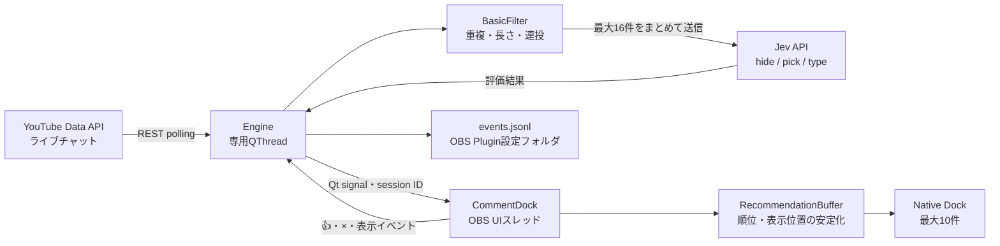

# AI Comments — OBS Native Dock v0.1

日本語YouTube LiveコメントをJevで評価し、配信者向けのNative Dockに推薦します。C++17 / Qt6 / libobs / obs-frontend-api。ブラウザDock、Overlay、外部アプリ、localhostサーバーは使いません。

## 起動

1. PluginをインストールしてOBSを起動します。`Docks → AI Comments` を表示します。
2. YouTube Live URLまたはVideo ID、YouTube Data APIキー、Jev APIキーを入力します。
3. `接続`。配信中のチャットが有効な動画が必要です。初回ページは履歴として読み飛ばし、その後の新着を推薦します。
4. `★` はhigh、上位4件を強調、最大10件。👍は良い推薦、×は候補から削除します。

JevキーとYouTubeキーは別です。公式YouTube Data APIの利用にはGoogle側のAPIキーが必要なため、当初の設定仕様に `YouTube API` を1欄追加しています。公開動画の読み取り用途で、キーのAPI制限をYouTube Data API v3に設定してください。アカウントへの投稿やBAN操作はありません。

キーはメモリのみで保持し、設定・ログには保存しません。毎回入力するか、起動環境の `TYPESAFE_API_KEY` / `YOUTUBE_API_KEY` を利用できます。キーをコマンド履歴やGitに保存しないでください。

## ビルド

OBS 30以降のDock API、Qt 6.6以降が必要です。開発時のQtはOBS同梱Qtと同じminor版、またはそれ以前を使ってください。

```sh
cmake -S . -B build -DCMAKE_BUILD_TYPE=Debug -DCMAKE_PREFIX_PATH=/path/to/obs-sdk-and-qt
cmake --build build -j 6
ctest --test-dir build --output-on-failure
```

このMacの開発環境では、OBS 32.2.2 / Qt 6.11.2、公式OBS 31.1.1の公開ヘッダーを使用します。

```sh
cmake -S . -B build -DCMAKE_BUILD_TYPE=Debug \
  -DCMAKE_PREFIX_PATH=/opt/homebrew/opt/qtbase \
  -DOBS_SOURCE_DIR="$PWD/.deps/obs-studio-31.1.1"
cmake --build build -j 6
ctest --test-dir build --output-on-failure
./scripts/install-macos.sh
```

macOSの `package-macos.sh` はQtリンク先をOBS同梱Frameworkへ変更し、ローカルのad-hoc署名を付けます。Homebrew Qtの二重ロードを防ぎます。再ビルド後は必ず再実行してください。配布用のDeveloper ID署名・公証は未実施です。Windows/LinuxはSDK向けCMake設定を用意していますが実機検証はしていません。

Qtなしでcoreだけを検証する場合：

```sh
cmake -S . -B build-core -DBUILD_PLUGIN=OFF -DBUILD_QT_TESTS=OFF
cmake --build build-core
ctest --test-dir build-core --output-on-failure
```

## 処理と上限

- 公式YouTube REST API `videos.list` でactiveLiveChatIdを解決し、`liveChatMessages.list` の `pollingIntervalMillis` を守って取得。
- YouTube現在の公式推奨は `streamList`。このMVPはQtで扱えるREST pollingを実装しています。受信前の遅延とクォータ消費は別途評価が必要です。
- Basic Filter：空、500 UTF-16 code units超、URLのみ、完全一致の重複、同一ユーザー5秒内4件目以降を除外。重複履歴は60秒・最大2,000件。
- 150msごとに最大16件を1つのJevリクエストへ。各コメントをindexで指定した独立した3つのChoiceで判定。同時リクエスト最大2、待ち行列128件、10秒超の待ち候補は破棄。
- 批判・反対意見だけではhideしない。API障害、未知ラベル、欠けた判定では未評価の本文を表示しない。
- high > medium。同tierは新しさ優先。10秒以内の候補で同種が3件続く場合に種類を混ぜる。lowは常に非表示。
- 候補は最大200件・受信後60秒。表示は最大10件。位置は3秒固定、新着highは1更新につき最大3件まで先頭追加の例外。
- mediumの待ち時間は表示固定のため3秒以上になる場合があります。p95 < 1秒は目標であり、現在の保証値ではありません。
- ネットワーク・JSON処理・ログ書き込みは専用QThread。OBS UIは描画と最大200候補の順位計算だけを行います。
- YouTube切断は1〜30秒のbackoff、401/403は認証・権限・クォータ確認を表示して自動再試行停止。Jev失敗は5秒、Retry-Afterがあれば最大300秒待機。

## ログ・評価

OBS Plugin設定フォルダの `events.jsonl` に追記します。macOSは通常 `~/Library/Application Support/obs-studio/plugin_config/obs-comment-dock/`。5 MiBごとに2世代までローテーションします。

`comment_received / comment_hidden / comment_scored / comment_shown / thumbs_up / dismissed` と、除外・過負荷・未判定イベントを記録します。timestamp、comment_id、hide、pick_value、comment_type、latency_msのみを基本とし、本文、投稿者、APIキーは保存しません。`comment_received` の `youtube_delivery_ms` は公開時刻と受信時刻の差であり、PC時計のずれも含みます。

`comment_shown.latency_ms` は同じmonotonic clockで受信→Dock推薦反映まで計測します。画面の物理的な描画完了や、スクロール領域内で実際に読まれたことを保証するものではありません。隠したDockではshownを記録しません。

```sh
python3 scripts/latency-report.py '/path/to/events.jsonl'
```

KPIの評価手順は [docs/acceptance.md](docs/acceptance.md)、今回の検証状態は [docs/verification.md](docs/verification.md)。👍の割合だけをRecommendation Precisionとは扱いません。

## アーキテクチャ

OBSに読み込まれるC++のNative Pluginです。UIはOBSのDock内で動き、通信・JSON処理・ログ書き込みを専用の`QThread`上の`Engine`に任せます。ブラウザ、外部プロセス、ローカルHTTPサーバーは使いません。



1. `src/plugin/plugin-main.cpp`がOBSのFrontend APIにDockを登録します。`src/ui/comment-dock.cpp`は入力、状態表示、推薦カード、👍・×を担当します。
2. `src/youtube/`がURLからVideo IDを検証・抽出し、API応答をコメントへ変換します。`Engine`は`videos.list`でライブチャットIDを取得し、`liveChatMessages.list`を指定間隔でpollingします。接続直後の最初のページは履歴として読み飛ばします。
3. `src/core/filter.cpp`が候補を絞り、`Engine`が短い間隔でJevへまとめて送ります。`src/jev/`はリクエストと応答の形式を検証し、コメントごとにhide、推薦度、種類を受け取ります。不正応答やAPI障害時は未評価の本文をDockへ渡しません。
4. 評価結果をQt signalでUIへ渡します。`src/core/recommendation-buffer.cpp`が期限切れ候補の除去、順位、表示位置の固定を担当し、Dockが上位のカードを描画します。再接続後はsession IDが異なる古い結果を無視します。
5. `Engine`がイベントを`events.jsonl`に記録します。設定にはVideo URLと表示条件だけを保存し、APIキーとコメント本文は保存しません。

主要な責務は`src/core/`（Qt・Jev非依存のフィルターと順位）、`src/youtube/`（YouTube形式）、`src/jev/`（Jev形式）、`src/plugin/`（OBS登録と通信・ログ）、`src/ui/`（Dock）に分かれます。`tests/`にはcore、API契約、UIの回帰テストと任意実行のJev実APIスモークがあります。

## 一次資料

- [Jev HTTP API](https://docs.typesafe.ai/api)
- [OBS Frontend API](https://docs.obsproject.com/reference-frontend-api)
- [YouTube liveChatMessages.list](https://developers.google.com/youtube/v3/live/docs/liveChatMessages/list)

## ライセンス

Live Chat Lens独自のソースコードは **MIT License** で公開します。ライセンス本文は`LICENSE`を参照してください。

このPluginはOBS Studioの`libobs`と`obs-frontend-api`にリンクします。OBS Studio / libobsは`GPL-2.0-or-later`で提供されているため、OBSと組み合わせたPluginバイナリを配布する場合は、適用されるGPL条件を含む第三者ライセンス条件を満たす必要があります。このリポジトリをMITで公開することは、OBS Studio、libobs、Qtなど依存コンポーネントのライセンス条件を変更するものではありません。

## 公開状態

[English overview](README.en.md) / [リリース状態](docs/release-status.md)。現在のGitHub公開はソースの確認用です。安定版のバイナリ配布やOBSフォーラムへのPlugin掲載はまだ行っていません。問題報告は[GitHub Issues](https://github.com/fjm2u/live_chat_lens/issues)へ。ログやスクリーンショットからキー・トークン・公開できないチャット内容を除いてください。

開発にはCodexによるAI支援を使用しました。安定版を配布する前に、独立したコードレビューと実ライブでの受け入れ確認が必要です。OBSフォーラムに掲載を申請する場合は、AIの使用方法を掲載説明にも明記します。
